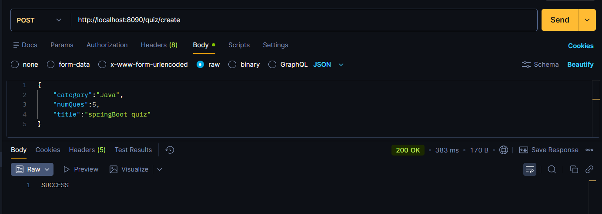
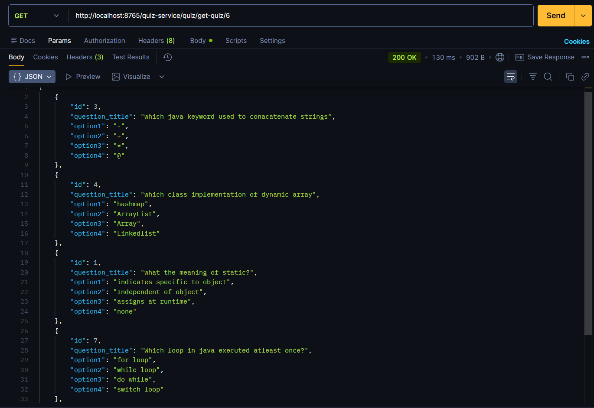
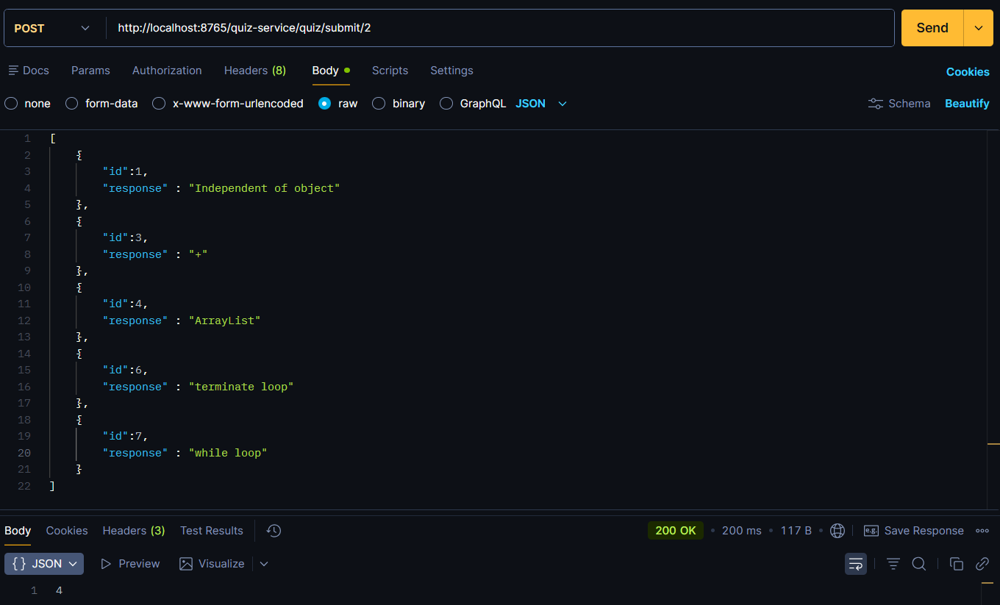

# Quiz Application — Microservices


A backend quiz management system built with **Spring Boot** and **Spring Cloud**, following a **microservices architecture**. The application handles question management, quiz creation, and quiz evaluation through independently deployable services that communicate via REST using OpenFeign and discover each other through Netflix Eureka.

This is the **microservices version** of the project, refactored from the original monolithic architecture.  
The monolithic version is available [here](https://github.com/Prashanth291/quiz-application-monolithic).

---

## Architecture

The application is decomposed into **three independently deployable services**, each with a distinct responsibility:

```
                         ┌──────────────────────┐
                         │   Service Registry    │
                         │   (Eureka Server)     │
                         │     Port: 8761        │
                         └──────────┬───────────┘
                            ▲               ▲
                  registers │               │ registers
                            │               │
              ┌─────────────┴──┐     ┌──────┴──────────────┐
              │  Quiz Service  │     │  Question Service    │
              │  Port: 8090    │     │  Port: 8080          │
              │                │     │                      │
              │  ┌──────────┐  │     │  ┌───────────────┐   │
              │  │Controller│  │     │  │  Controller    │   │
              │  └────┬─────┘  │     │  └───────┬───────┘   │
              │       │        │     │          │           │
              │  ┌────▼─────┐  │     │  ┌───────▼───────┐   │
              │  │ Service  │──╋─────╋─▶│   Service     │   │
              │  └────┬─────┘  │Feign│  └───────┬───────┘   │
              │       │        │     │          │           │
              │  ┌────▼─────┐  │     │  ┌───────▼───────┐   │
              │  │Repository│  │     │  │  Repository   │   │
              │  └────┬─────┘  │     │  └───────┬───────┘   │
              └───────┼────────┘     └──────────┼───────────┘
                      │                         │
               ┌──────▼──────┐          ┌───────▼───────┐
               │ PostgreSQL  │          │  PostgreSQL   │
               │  (quiz_db)  │          │ (question_db) │
               └─────────────┘          └───────────────┘
```

**Service responsibilities:**

| Service            | Port  | Role                                                                 |
|--------------------|-------|----------------------------------------------------------------------|
| Service Registry   | 8761  | Eureka Server — service registration and discovery                   |
| Question Service   | 8080  | Manages questions (CRUD, category filtering, scoring, random selection) |
| Quiz Service       | 8090  | Manages quizzes (creation, retrieval, submission) — delegates to Question Service via Feign |

**Inter-service communication:**  
Quiz Service communicates with Question Service through **OpenFeign**, a declarative REST client. Service endpoints are resolved at runtime via **Eureka service discovery** — no hardcoded URLs.

---

## How We Migrated from Monolith to Microservices

The original [monolithic application](https://github.com/Prashanth291/quiz-application-monolithic) bundled all functionality — question management, quiz management, business logic, and data access — into a single deployable JAR backed by one PostgreSQL database.

### What Changed

| Aspect               | Monolith                                  | Microservices (this repo)                              |
|----------------------|-------------------------------------------|--------------------------------------------------------|
| **Deployment**       | Single JAR                                | 3 independent services, each with its own JAR          |
| **Database**         | Single shared `question_db`               | Database per service (`question_db` + `quiz_db`)       |
| **Communication**    | In-process method calls                   | REST calls via OpenFeign                               |
| **Service Discovery**| N/A                                       | Netflix Eureka                                         |
| **Quiz ↔ Question**  | Direct service-layer method invocation    | Feign client calling Question Service REST endpoints   |
| **Quiz entity**      | Stored `List<Question>` (JPA `@ManyToMany`) | Stores `List<Integer>` question IDs (`@ElementCollection`) |
| **Scalability**      | Scale entire app                          | Scale individual services independently                |

### Steps Taken

1. **Extracted Question Service** — Moved all question-related logic (entity, repository, service, controller) into its own Spring Boot application with its own database (`question_db`). Added three new internal endpoints (`/questions/generate`, `/questions/getQuestions`, `/questions/get-score`) to support inter-service communication.

2. **Extracted Quiz Service** — Moved quiz-related logic into a separate Spring Boot application with its own database (`quiz_db`). The `Quiz` entity was redesigned to store only question IDs instead of full `Question` objects, since questions now live in a different service/database.

3. **Introduced OpenFeign** — Replaced direct in-process method calls with a declarative Feign client (`QuizInterface`) in the Quiz Service that calls Question Service REST endpoints.

4. **Added Service Registry** — Introduced a Netflix Eureka server so services discover each other by name (`QUESTION-SERVICE`) rather than hardcoded host/port.

5. **Database per Service** — Split the single `question_db` into two databases: `question_db` (Question Service) and `quiz_db` (Quiz Service), enforcing data ownership boundaries.

---

## Tech Stack

| Component           | Technology                          |
|---------------------|-------------------------------------|
| Language            | Java 21                             |
| Framework           | Spring Boot 3.2.5                   |
| Cloud               | Spring Cloud 2023.0.1               |
| Service Discovery   | Netflix Eureka                      |
| Inter-Service Comm  | OpenFeign                           |
| Web Layer           | Spring Web MVC                      |
| Persistence         | Spring Data JPA / Hibernate         |
| Database            | PostgreSQL (one per service)        |
| Build Tool          | Maven                               |
| Code Generation     | Lombok                              |

---

## Features

- **Question CRUD** — Create, read, update, and delete questions
- **Category Filtering** — Retrieve questions filtered by category
- **Quiz Creation** — Generate a quiz by selecting random questions from a given category
- **Quiz Retrieval** — Fetch quiz questions with answer options (correct answers excluded from response)
- **Quiz Submission & Scoring** — Submit answers and receive a computed score
- **Service Discovery** — Services register with and discover each other via Eureka
- **Declarative REST Calls** — Inter-service communication through OpenFeign

---

## REST API Endpoints

### Question Service (`http://localhost:8080`)

| Method | Endpoint                          | Description                              |
|--------|-----------------------------------|------------------------------------------|
| `GET`  | `/questions/allQuestions`          | Get all questions                        |
| `GET`  | `/questions/question/{id}`        | Get a question by ID                     |
| `POST` | `/questions/add-question`         | Add a new question                       |
| `PUT`  | `/questions/update/{id}`          | Update an existing question              |
| `DELETE`| `/questions/delete/{id}`         | Delete a question by ID                  |
| `GET`  | `/questions/category/{category}`  | Get all questions in a category          |
| `GET`  | `/questions/generate`             | Get random question IDs (params: `category`, `numQues`) |
| `POST` | `/questions/getQuestions`         | Get questions by IDs (answers excluded)  |
| `POST` | `/questions/get-score`            | Calculate score from submitted responses |

> The last three endpoints (`/generate`, `/getQuestions`, `/get-score`) are **internal endpoints** used by Quiz Service via Feign. They were introduced during the microservices decomposition.

### Quiz Service (`http://localhost:8090`)

| Method | Endpoint              | Description                                          |
|--------|-----------------------|------------------------------------------------------|
| `POST` | `/quiz/create`        | Create a quiz (body: `{category, numQues, title}`)   |
| `GET`  | `/quiz/get-quiz/{id}` | Get quiz questions (answers excluded)                |
| `POST` | `/quiz/submit/{id}`   | Submit responses and get score                       |

---

## Project Structure

```
quiz-application-microservice/
├── service-registry/                        # Eureka Server
│   ├── pom.xml
│   └── src/main/
│       ├── java/.../ServiceRegistryApplication.java
│       └── resources/application.properties
│
├── question-service/                        # Question microservice
│   ├── pom.xml
│   └── src/main/
│       ├── java/com/prashanth291/
│       │   ├── QuestionServiceApplication.java
│       │   └── question_service/
│       │       ├── controller/
│       │       │   └── QuestionController.java      # REST endpoints for questions
│       │       ├── model/
│       │       │   ├── Question.java                # JPA entity — question table
│       │       │   ├── QuestionWrapper.java         # DTO — question without answer
│       │       │   └── Response.java                # DTO — submitted answer
│       │       ├── repository/
│       │       │   └── QuestionRepository.java      # JPA repo + native query
│       │       └── service/
│       │           └── QuestionService.java         # Business logic for questions
│       └── resources/application.properties
│
├── quiz-service/                            # Quiz microservice
│   ├── pom.xml
│   └── src/main/
│       ├── java/com/prashanth291/quiz_service/
│       │   ├── QuizServiceApplication.java          # @EnableFeignClients
│       │   ├── controller/
│       │   │   └── QuizController.java              # REST endpoints for quizzes
│       │   ├── feign/
│       │   │   └── QuizInterface.java               # Feign client → Question Service
│       │   ├── model/
│       │   │   ├── Question.java                    # Entity (shared structure)
│       │   │   ├── QuestionWrapper.java             # DTO — question without answer
│       │   │   ├── Quiz.java                        # JPA entity — quiz with question IDs
│       │   │   ├── QuizDto.java                     # DTO — quiz creation request
│       │   │   └── Response.java                    # DTO — submitted answer
│       │   ├── repository/
│       │   │   └── QuizRepository.java              # JPA repository for quizzes
│       │   └── service/
│       │       └── QuizService.java                 # Quiz logic (delegates via Feign)
│       └── resources/application.properties
│
└── screenshots/                             # API output screenshots
    ├── createQuiz.png
    ├── getQuestionsFromId.png
    └── calculateScore.png
```

---

## How to Run

### Prerequisites

- Java 21
- Maven 3.9+
- PostgreSQL (running locally or remotely)

### 1. Set up the databases

Create two PostgreSQL databases:

```sql
CREATE DATABASE question_db;
CREATE DATABASE quiz_db;
```

### 2. Configure database credentials

Edit `question-service/src/main/resources/application.properties`:

```properties
spring.datasource.url=jdbc:postgresql://localhost:5432/question_db
spring.datasource.username=<your_username>
spring.datasource.password=<your_password>
```

Edit `quiz-service/src/main/resources/application.properties`:

```properties
spring.datasource.url=jdbc:postgresql://localhost:5432/quiz_db
spring.datasource.username=<your_username>
spring.datasource.password=<your_password>
```

Hibernate will auto-create/update tables on startup (`ddl-auto=update`).

### 3. Start the services (in order)

**Start Service Registry first** (other services register with it on startup):

```bash
cd service-registry
./mvnw spring-boot:run
```

**Start Question Service:**

```bash
cd question-service
./mvnw spring-boot:run
```

**Start Quiz Service:**

```bash
cd quiz-service
./mvnw spring-boot:run
```

> On Windows, use `mvnw.cmd spring-boot:run` instead.

### 4. Verify

- Eureka Dashboard: `http://localhost:8761`
- Question Service: `http://localhost:8080/questions/allQuestions`
- Quiz Service: `http://localhost:8090/quiz/get-quiz/1`

---

## API Output Screenshots

### Create Quiz

`POST /quiz/create`



### Get Quiz Questions

`GET /quiz/get-quiz/{id}`



### Submit Quiz & Calculate Score

`POST /quiz/submit/{id}`



---

## Feign Client — Inter-Service Communication

The Quiz Service uses a declarative Feign client to call the Question Service. Service lookup is handled by Eureka — the client references the service by its registered name (`QUESTION-SERVICE`), not by host/port.

```java
@FeignClient("QUESTION-SERVICE")
public interface QuizInterface {

    @GetMapping("/questions/generate")
    ResponseEntity<List<Integer>> getQuestionsForQuiz(
        @RequestParam String category, @RequestParam Integer numQues);

    @PostMapping("/questions/getQuestions")
    ResponseEntity<List<QuestionWrapper>> getQuestionsFromId(
        @RequestBody List<Integer> questionIds);

    @PostMapping("/questions/get-score")
    ResponseEntity<Integer> calculateScore(
        @RequestBody List<Response> response);
}
```

**Request flow for quiz creation:**

```
Client                    Quiz Service                  Question Service
  │                            │                              │
  │  POST /quiz/create         │                              │
  │ ─────────────────────────▶ │                              │
  │                            │  GET /questions/generate     │
  │                            │ ────────────────────────────▶│
  │                            │     List<Integer> (IDs)      │
  │                            │ ◀────────────────────────────│
  │                            │                              │
  │                            │  saves Quiz(title, IDs)      │
  │      "SUCCESS"             │  to quiz_db                  │
  │ ◀───────────────────────── │                              │
```

---

## Architectural Evolution: Monolith → Microservices

| Concern              | Monolith                              | Microservices (this repo)                    |
|----------------------|---------------------------------------|----------------------------------------------|
| Deployment           | Single JAR                            | 3 independent JARs                           |
| Database             | Single shared PostgreSQL DB           | Database per service                         |
| Communication        | In-process method calls               | REST calls via OpenFeign                     |
| Service Discovery    | N/A                                   | Netflix Eureka                               |
| Coupling             | Tight — all modules share a process   | Loose — services interact via REST contracts |
| Scalability          | Scale everything together             | Scale individual services independently      |
| Fault Isolation      | Single point of failure               | Failure in one service doesn't crash others  |

**Monolithic version:** [quiz-application-monolithic](https://github.com/Prashanth291/quiz-application-monolithic)  
**Microservices version:** [quiz-application-microservice](https://github.com/Prashanth291/quiz-application-microservice) *(this repo)*
